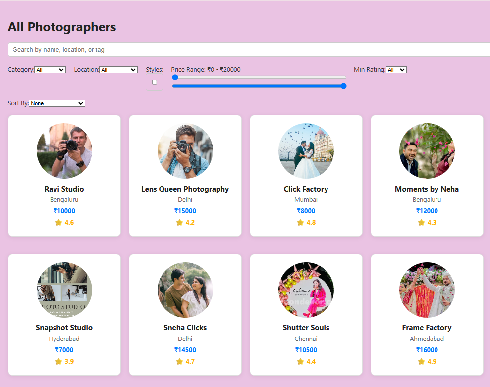
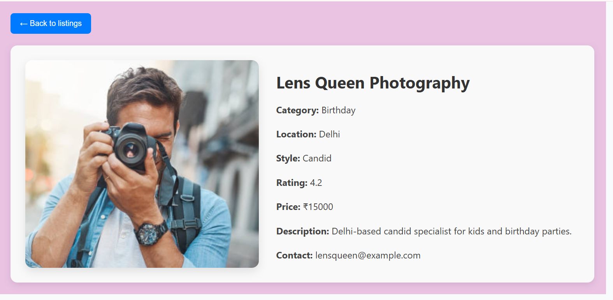

# Photographers Directory - React + JSON Server

A simple React project displaying a list of photographers fetched from a mock REST API powered by JSON Server.

---

## Live Demo

[Vercel Deployment](https://frontend-assignment-sage-five.vercel.app/)

## GitHub Repository

[https://github.com/Ashish20cs17/frontend-Assignment-for-Pixisphere](https://github.com/Ashish20cs17/frontend-Assignment-for-Pixisphere)

---
## Screenshots

### Home Page


### Profile Page



## Features

- Photographer listing with cards showing key details
- Search bar supporting fuzzy search by name, location, or tags
- Advanced filters: price range, ratings, styles, and city
- Sorting options (price, rating, recently added)
- Pagination with "Load More" button or infinite scroll
- Photographer profile page with full details, gallery, and reviews

---

## Setup Instructions

1. **Clone the repository**

```bash
git clone https://github.com/Ashish20cs17/frontend-Assignment-for-Pixisphere.git
cd frontend-Assignment-for-Pixisphere
## Quick Start

#1. Install project dependencies:

```bash
npm install
Start the mock API server with JSON Server:


#2. json-server --watch db.json --port 3001
Start the React development server:


npm start
The React app will run on http://localhost:3000 and the JSON Server API will be available at http://localhost:3001/photographers.


## Filtering, Debounce & Logic

- **Filtering:** Multi-criteria filters (price, rating, styles, city) update results dynamically.  
- **Debounce:** Search input uses debounce (~300ms) to reduce unnecessary re-renders.  
- **Logic:** Data fetched once from API; filtering and sorting done client-side; pagination loads more results; profile page shows detailed info.

